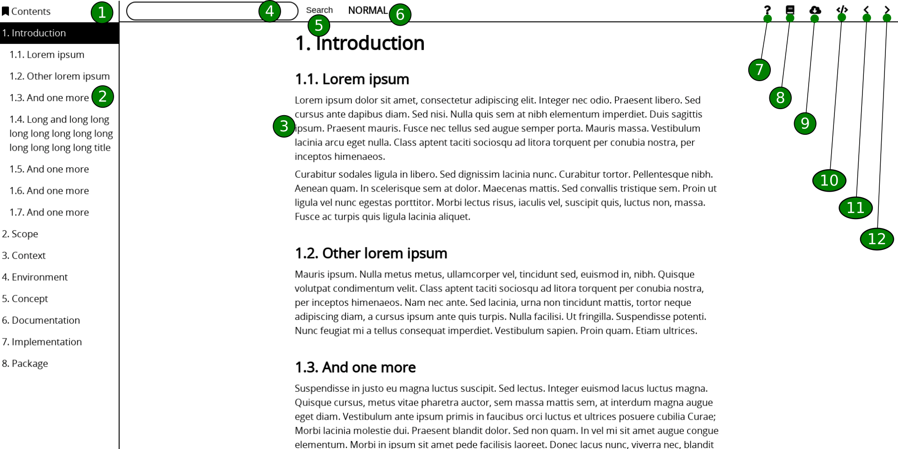
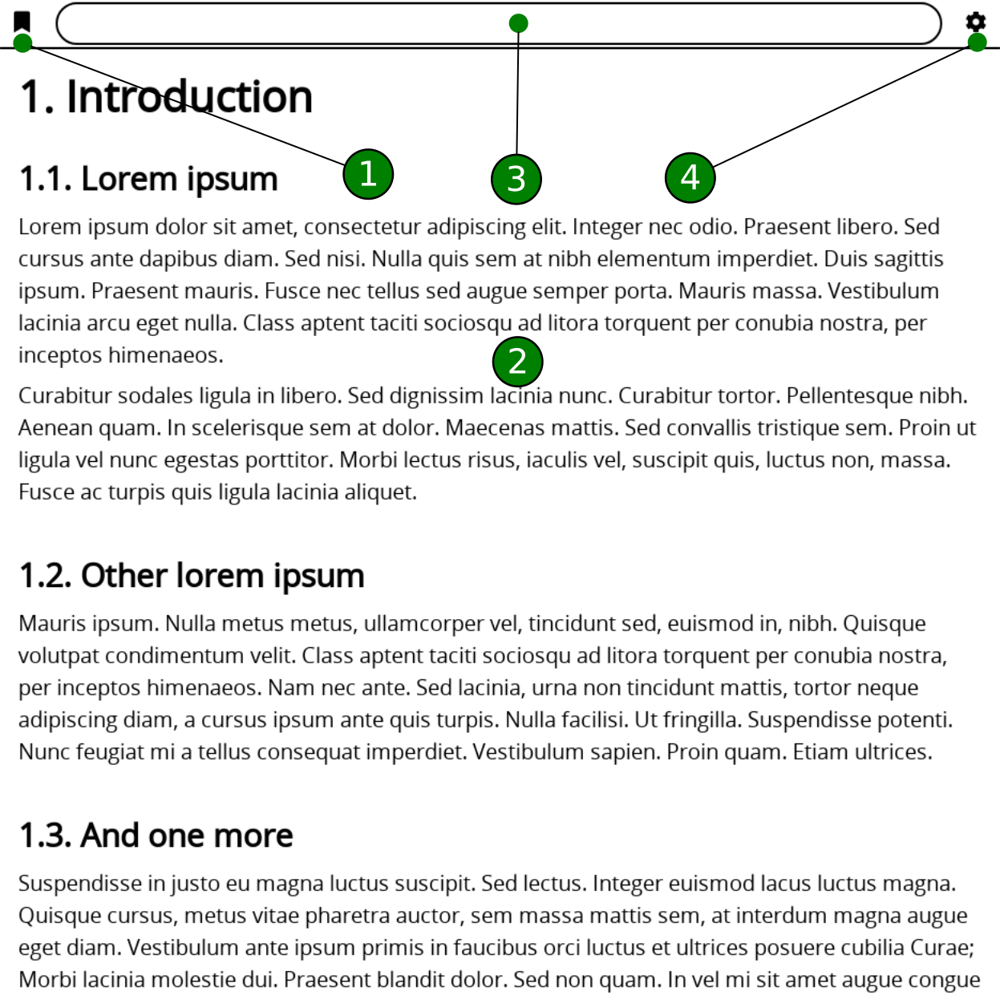

Tutorial
********

Display modes
=============

**fx** displays documents by the best way. To do that, **fx** provides two
display modes:

* BASIC. This display mode is applies for Smart Phones, Tablets where screen's
  width is narrow. In this mode, almost components are hidden to save space
  for content display. Hidden components are show when needed by two buttons
  in top-left and top-right. See more detail in :ref:`fx-doc-basic-mode`.
* FULL. This display mode is applies for PCs where screen's width is enough to
  display contents and all of components. It makes accessing to contents and
  other resource more quickly. See more detail in :ref:`fx-doc-full-mode`.

This table shows how to display modes are apply depends on `View Port`_ value.

.. table:: fx display modes

        =============== ==============  ======================================
        Display mode    View port       Main target devices
        =============== ==============  ======================================
        BASIC           < 1200          Smart phones, Tablets
        FULL            >= 1200         Laptops, Desktop PCs
        =============== ==============  ======================================

It is also useful to decide what device will be use or buy one with table
below:

.. table:: Devices and display modes

        ======================================================= ============= 
        Device                                          Display mode
        ======================================================= ============= 
        iPhone 3, 4, 5, 6, 7, 8, X                              BASIC
        iPad Pro                                                BASIC, FULL
        iPad 1, 2, 3, 4, Air, Air2, Pro 9.7                     BASIC
        iPad mini 1, 2, 3, 4                                    BASIC 
        Samsung Galaxy S2, S3, S4, S5, S6, S7, S8               BASIC
        Samsung Galaxy S3 mini, S4 mini                         BASIC
        Samsung Galaxy S7 edge                                  BASIC
        Samsung Galaxy S8+                                      BASIC
        Samsung Galaxy Note                                     BASIC
        Samsung Galaxy Note 2, 3, 4, 8                          BASIC
        Samsung Galaxy Nexus                                    BASIC
        Samsung Galaxy Tab 1 8.9", 2 10", 3 10"                 BASIC, FULL
        Samsung Galaxy Tab 2 7"                                 BASIC
        Samsung Nexus 10                                        BASIC, FULL
        Microsoft Surface                                       BASIC, FULL
        Microsoft Surface Pro 1, 2, 3                           BASIC, FULL
        Amazon Kindle Fire HD 8.9                               BASIC, FULL
        Amazon Kindle Fire 1, HD 7                              BASIC
        LG Nexus 4, 5                                           BASIC
        LG G Pad 8.3                                            BASIC
        HTC Evo 3D, 8X, One                                     BASIC
        Sony Experia P, S, Z, Z3                                BASIC
        Blackberry Classic, Q10, Z30, Z10, Leap, Passport       BASIC
        Blackberry Playbook                                     BASIC
        ======================================================= ============= 
 

.. _fx-doc-full-mode:

FULL mode
=========

#. ``TOC Link``. Go to Table of Contents page.
#. ``TOC Panel``. It displays document's Table of Contents, 3 levels
   is maximum.
#. ``Content Area``. It displays document's content which corresponds with
   current section.
#. ``Search Box``. It is text input, use for input keywords to search.
   Searching returns sections which contains keywords. To search, select
   ``Search Box``, type keywords then press ``ENTER`` key or click to ``Search
   Button`` to start
#. ``Search Button``. Click to this button start searching.
#. ``Mode Label``. Display curent ``Shortcut keys`` mode.
#. ``About Link``. Go to ``About Page`` where display information about
   document.
#. ``Help Link``. Go to ``Help Page`` where display basic manual to read
   document.
#. ``Downloads Link``. Go to ``Downloads Page`` where contains options to
   download other formats of document.
#. ``Source Link``. Go to text file which is source of current section in
   `reStructureText`_ language. 
#. ``Next Link``. Go to next section. If next section is not available, this
   link is not shows.
#. ``Previous Link``. Go to previous section. If previous section is not
   available, this link is not shows.

.. _fx-doc-basic-mode:

BASIC mode
==========

#. ``TOC Button``. Open Table of Contents window which displays Table of
   Contents, same as ``#2`` in :ref:`fx-doc-full-mode`.
#. ``Content Area``. It is same with ``#3`` in :ref:`fx-doc-full-mode`.
#. ``Search Box``. It is same with ``#4`` in :ref:`fx-doc-full-mode`.
#. ``Links Button``. Open Links Window, contains links corresponds with ``#7``
   - ``#12`` in :ref:`fx-doc-full-mode`.

.. _reStructureText: http://www.sphinx-doc.org/en/master/rest.html#

Shortcut keys
=============

.. table:: Shortcut keys

        =============== ======================================================
        Key             Description
        =============== ======================================================
        ESC             Go to NORMAL mode
        BACKQUOTE       Go to SEARCH mode
        PgUp            Scroll up content
        PgDn            Scroll down content
        g               Toogle GOTO mode
        n               Go to next section
        p               Go to previous section
        t               Go to table of contents
        h               Go to help page
        a               Go to about page
        d               Go to downloads page
        =============== ======================================================

.. _View Port: https://developer.mozilla.org/en-US/docs/Mozilla/Mobile/Viewport_meta_tag
